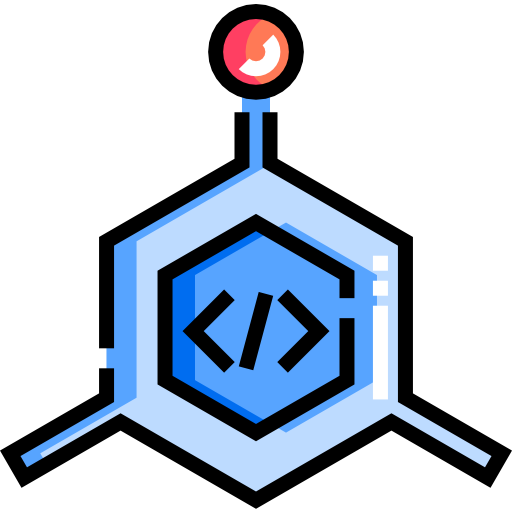

[![MIT License][license-shield]][license-url]


<!-- PROJECT LOGO -->
<br />
<p align="center">
  <a href="#">
    
  </a>

  <h3 align="center">Common Utilities</h3>
</p>


<!-- TABLE OF CONTENTS -->
<details open="open">
	<summary>Table of Contents</summary>
	<ol>
		<li>
			<a href="#about-the-project">About The Project</a>
			<ul>
				<li><a href="#built-with">Built With</a></li>
				<li><a href="#supported-platforms">Supported Platforms</li>
			</ul>
		</li>
		<li>
			<a href="#getting-started">Getting Started</a>
			<ul>
				<li><a href="#including-library-in-your-project">Including library in your project</a></li>
				<li><a href="#building-library-on-your-own">Building library on your own</a></li>
			</ul>
		</li>
		<li><a href="#usage">Usage</a></li>
		<li><a href="#license">License</a></li>
		<li><a href="#acknowledgements">Acknowledgements</a></li>
	</ol>
</details>


<!-- ABOUT THE PROJECT -->
## About The Project

This repository is a collection of utilities I have used multiple times in different projects, grouped into a single library.

It consists of:

 - Definition of aliases for basic types
 - Definition of aliases for smart pointers
 - Filesystem utilities which allow to:
	 + Create/Delete/Read/Update files
	 + Create/Delete/Read directories
 - UUID generators
 - Hashing utilities
 - Time utilities
 - Other useful functionalities such as simplified `std::foreach`, converting enums back/forth from/to their underlying types, and others

This list is not definitive and will most likely be expanded in the future.
### Built With
* [C++17](https://en.cppreference.com/w/cpp/17)
* [xxHash](https://github.com/Cyan4973/xxHash)
* [stduuid](https://github.com/mariusbancila/stduuid)
* [fmt](https://github.com/fmtlib/fmt)

### Supported Platforms
Currently, the library has only been built and tested on:

 - Windows 10

<!-- GETTING STARTED -->
## Getting Started

This section contains all required information both to build the library as a subproject and as a standalone project.

### Including library in your project
Currently, the library only supports building via `CMake`.
In order to use the library in your project you have to clone the repository, provide the library with a few defines and add it to your main project.

This library depends on a few libraries that must be provided in order for it to build correctly.

You have to set the following before including `CommonUtilities` in your `CMakeLists.txt` file:

 - `CONAN_PKG::fmt` - CMake target containing the [`fmt library`](https://github.com/fmtlib/fmt)
 - `CONAN_PKG::stduuid`- CMake target containing the [`stduuid library`](https://github.com/mariusbancila/stduuid)
 
If you use `Conan` as your dependency manager, all you have to do is add `fmt/[>=8.0.0]` and `stduuid/1.0` to your `conanfile.py`. There is also a possibility that one of your dependencies already requires `fmt` or `stduuid`. In that case, you don't have to add the requirements.

Additionally, you can specify the following before including the library:

 - `CT_VENDOR_XXHASH` - CMake variable containing name of the `xxHash` library target. If your project already uses `xxHash` as its dependency, initialize the `CT_VENDOR_XXHASH` library with the name of your `xxHash` target eg:

```cmake
set(CT_VENDOR_XXHASH xxHash::xxhash)
```

`CommonUtilities` uses its own version of the `xxHash` library, but you can replace it with your version this way. Note however that it is not required

 - `CT_COMMON_NAMESPACE` - All files of the library use the `CT_COMMON_NAMESPACE` macro as their namespace definition. This macro is initialized with the value of the CMake variable with the same name. Thanks to that, you can define the `CT_COMMON_NAMESPACE` CMake variable with your common namespace in order for the library's code to reside in namespace of your project. This simplifies usage of the library. eg.
 
Instead of typing:


```C++
#include <Common/Types.h>

// some code

ct::uint someVariable = SOME_VALUE;
```
you can provide the library with your namespace definition and use its code directly:

```c++
#include <Common/Types.h>

// some code

uint someVariable = SOME_VALUE;
```
The library will use the `ct` namespace if `CT_COMMON_NAMESPACE` CMake variable is not defined

---

Once you define all variables, all you have to do is include the library by running:

```cmake
add_subdirectory(CommonUtilities)
```
The library will create the `CT::common_utils` target.

Here's the simple example:

```cmake
# Set xxHash target variable
set(CT_VENDOR_XXHASH xxHash::xxhash)

# Set our common namespace
set(CT_COMMON_NAMESPACE myNamespace)

# Add CommonUtilities as a subproject
add_subdirectory("CommonUtilities" CommonUtils)

# Create our project's library
add_library(${MY_LIB_TARGET_NAME} STATIC "${MY_LIB_SRC_LIST}" "${MY_LIB_HEADERS_LIST}")
target_include_directories(${MY_LIB_TARGET_NAME} PUBLIC "${MY_LIB_INCLUDE_DIR}")
target_compile_features(${MY_LIB_TARGET_NAME} PUBLIC cxx_std_17)

# Link CommonUtils library to our project's library
target_link_libraries(
	${MY_LIB_TARGET_NAME}
	PRIVATE
		CT::common_utils
)
```


### Building library on your own
There are two ways to build the library on your own. CommonUtilities is based on the [`BasicCppSetup`](https://github.com/ComaszTyrulik/BasicCppSetup) which describes building process. You can find it [here](https://github.com/ComaszTyrulik/BasicCppSetup#installation).

If however, you don't want to use the building scripts provided by the library, you are going to need:

#### [CMake](https://cmake.org/)
Minimum required version is `3.16`.
Make sure to add CMake to your `PATH`

#### [Conan](https://conan.io/)
Minimum required version is `1.37.2`.
Make sure to add Conan to your `PATH`.

#### Building
Once you have all the prerequisites installed, go to the directory where you cloned the `CommonUtilities` and run:

```sh
git submodule update --init --recursive

# If you want to download dependencies for every build type, you
# have to run the command once for each build type
conan install "conan/conanfile.py" -if="conan/build" -g cmake_multi --build=missing -s build_type=[Debug/Release/RelWithDebInfo/MinSizeRel]

cmake -S . -B build

# If you want to build library for every config, you have to run
# the command once for each config
cmake --build build --config [Debug/Release/RelWithDebInfo/MinSizeRel]
```
This will build library into the `build/lib/[Debug/Release/RelWithDebInfo/MinSizeRel]` directory.

## Usage
Once you add the library to your project, just include `<Common/*RequiredFile*>` and you're good to go.

## License
Distributed under the MIT License. See `LICENSE` for more information.

## Acknowledgements
* [README template](https://github.com/othneildrew/Best-README-Template)
* Icons made by [Freepik](https://www.freepik.com) from [www.flaticon.com](https://www.flaticon.com/)


[license-shield]: https://img.shields.io/github/license/othneildrew/Best-README-Template.svg?style=for-the-badge
[license-url]: LICENSE
